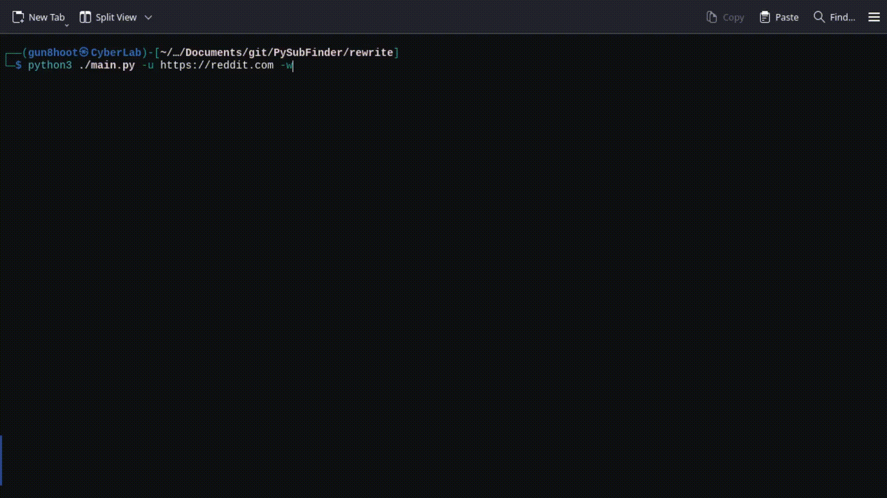

# PySubFinder
Subdomain finder write in python
### Install on Linux
---
- Clone the repository from Github
```shell
git clone https://github.com/Gun8hoot/PySubFinder.git
```
- Go to the project repository
```shell
cd ./PySubFinder
```
- **(optional)** :  Create a python virtual environment before installing every module
```shell
python3 -m venv .venv && source ./.venv/bin/activate
```
- Go to the project repository
```shell
pip install -r ./requirements.txt
```
### Usage
---
```shell
python3 ./main.py -u {URL} -w {WORDLIST_PATH}
```


<br><br>

---
