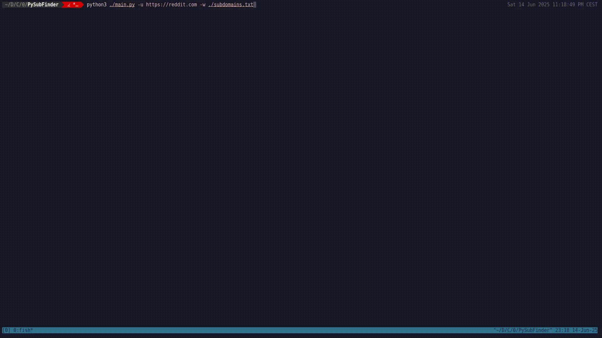

<h1 style="text-align: center;">PySubFinder</h1>

Simple subdomain finder write in python3 
### Install on Linux
---

- Install python3
```bash
sudo apt install python3
```

- Clone the repository from Github
```bash
git clone https://github.com/Gun8hoot/PySubFinder.git
```

- Go to the project repository
```shell
cd ./PySubFinder
```

- **(optional)** :  Create a python virtual environment before installing every module
```shell
python3 -m venv .venv && source ./.venv/bin/activate
```

- Go to the project repository
```shell
pip install -r ./requirements.txt
```
- **(optional)** :  Extract the wordlist in subdomains_WL.tar
```shell
tar -xvf ./subdomains_WL.tar
```

### Usage
---
```shell
python3 ./main.py -u {URL} -w {WORDLIST_PATH}
```


